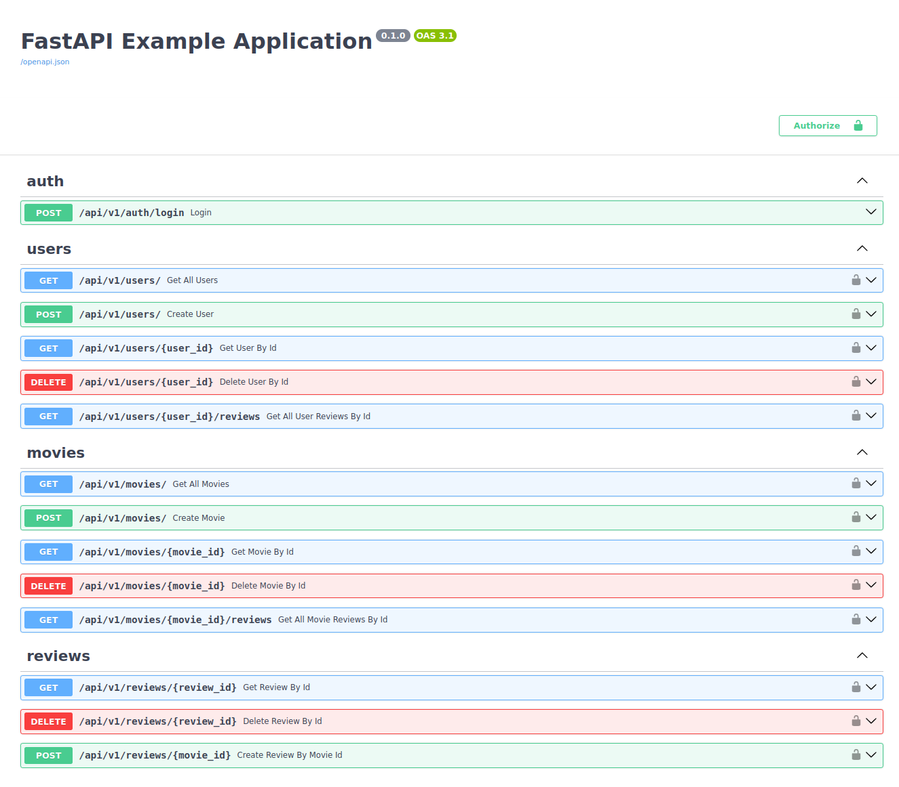

<a name="readme-top"></a>

[![Contributors][contributors-shield]][contributors-url]
[![Forks][forks-shield]][forks-url]
[![Stargazers][stars-shield]][stars-url]
[![Issues][issues-shield]][issues-url]
[![MIT License][license-shield]][license-url]

<br />
<div align="center">
  <a href="https://github.com/1owkeyme/fastapi-clean-architecture-example">
    
  </a>

<h3 align="center">FastAPI Clean Architecture Example</h3>

  <p align="center">
    Dive into a Python Backend FastAPI example, showcasing Bob Martin's Clean Architecture principles! 🎉 
    <br />
    Experience the power of clean code and scalability! 🚀
    <br />
    <a href="https://github.com/1owkeyme/fastapi-clean-architecture-example?tab=readme-ov-file#project-overview"><strong>Explore the docs »</strong></a>
    <br />
    <br />

  </p>
</div>
<details>
<summary>
<b>Table of contents</b>
</summary>

- [Project Overview](#project-overview)
  - [Built With](#built-with)
- [Getting Started](#getting-started)
  - [Quick Start with Docker](#quick-start-with-docker)
    - [Prerequisites](#prerequisites)
    - [Setup Process](#setup-process)
  - [Local Development](#local-development)
    - [Prerequisites](#prerequisites-1)
    - [Setup Process](#setup-process-1)
- [Acknowledgments](#acknowledgments)

</details>

## Project Overview



<p align="right">[ <a href="#readme-top">back to top</a> ]</p>

### Built With

- [![FastAPI][FastAPI]][FastAPI-url]
- [![Pydantic][Pydantic]][Pydantic-url]
- [![SQLA][SQLA]][SQLA-url]

<p align="right">[ <a href="#readme-top">back to top</a> ]</p>

## Getting Started

### Quick Start with Docker

#### Prerequisites

- `docker`
- `docker-dompose`

#### Setup Process

1. Clone this repo

```
git clone https://github.com/1owkeyme/fastapi-clean-architecture-example.git

cd ./fastapi-clean-architecture-example
```

2. Run `./docker-compose.postgres.yml`

```
docker compose -f docker-compose.postgres.yml --env-file .env.example -p postgres up -d
```

3. Run `./docker-compose.app.yml`

```
docker compose -f docker-compose.app.yml --env-file .env.example -p app up -d --build
```

4. Wait 5 seconds and navigate to `http://localhost:4343/docs` and explore

Default admin username and password are set in `./.env.example`

5. (Optional) Clean up everything

```
docker compose -f docker-compose.app.yml --env-file .env.example -p app down

# provide -v option only if you want to delete volumes
docker compose -f docker-compose.postgres.yml --env-file .env.example -p postgres down -v
```

### Local Development

#### Prerequisites

- `python ^3.11`
- `poetry ^1.7`
- `docker` and `docker-dompose` _OR_ existing **PostgreSQL** database

#### Setup Process

1. Clone this repo

```
git clone https://github.com/1owkeyme/fastapi-clean-architecture-example.git

cd ./fastapi-clean-architecture-example
```

2. Install dependencies and activate virtual environment

```
poetry install --no-root

poetry shell
```

3. Setup **PostgreSQL** database

To setup database 2 options are available:

- Use `./docker-compose.postgres.yml`

  ```
  docker compose -f docker-compose.postgres.yml --env-file .env.example -p postgres up -d
  ```

- Use existing database

  In case of using existing database you must configure **POSTGRES_HOST** and **POSTGRES_PORT** environment variable inside `./.env.example`

4. Apply migrations and init database

```
alembic upgrade head

python ./src/init_db.py
```

5. Run app with python

```
python ./src/start.py
```

6. Navigate to `http://localhost:4343/docs` and explore

Default admin username and password are set in `./.env.example`

7. (Optional) Clean up everything in case of using `docker-compose.postgres.yml`

```
# provide -v option only if you want to delete volumes
docker compose -f docker-compose.postgres.yml --env-file .env.example -p postgres down -v
```

## Acknowledgments

- [**The Clean Code Blog** by Uncle Bob](https://blog.cleancoder.com/uncle-bob/2012/08/13/the-clean-architecture.html)
- [**Full Stack FastAPI Template** by tiangolo](https://github.com/tiangolo/full-stack-fastapi-template/tree/master)
- [**Best README Template** by othneildrew](https://github.com/othneildrew/Best-README-Template)

<p align="right">(<a href="#readme-top">back to top</a>)</p>

[contributors-shield]: https://img.shields.io/github/contributors/1owkeyme/fastapi-clean-architecture-example.svg?style=for-the-badge
[contributors-url]: https://github.com/1owkeyme/fastapi-clean-architecture-example/graphs/contributors
[forks-shield]: https://img.shields.io/github/forks/1owkeyme/fastapi-clean-architecture-example.svg?style=for-the-badge
[forks-url]: https://github.com/1owkeyme/fastapi-clean-architecture-example/network/members
[stars-shield]: https://img.shields.io/github/stars/1owkeyme/fastapi-clean-architecture-example.svg?style=for-the-badge
[stars-url]: https://github.com/1owkeyme/fastapi-clean-architecture-example/stargazers
[issues-shield]: https://img.shields.io/github/issues/1owkeyme/fastapi-clean-architecture-example.svg?style=for-the-badge
[issues-url]: https://github.com/1owkeyme/fastapi-clean-architecture-example/issues
[license-shield]: https://img.shields.io/github/license/1owkeyme/fastapi-clean-architecture-example.svg?style=for-the-badge
[license-url]: https://github.com/1owkeyme/fastapi-clean-architecture-example/blob/master/LICENSE.txt

<!-- Badges -->

[FastAPI]: https://img.shields.io/badge/fastapi-20232A?style=for-the-badge&logo=fastapi&logoColor=%23009688
[FastAPI-url]: https://fastapi.tiangolo.com/
[Pydantic]: https://img.shields.io/badge/pydantic-20232A?style=for-the-badge&logo=pydantic&logoColor=%23E92063
[Pydantic-url]: https://docs.pydantic.dev/latest/
[SQLA]: https://img.shields.io/badge/sqlalchemy-20232A?style=for-the-badge&logo=sqlalchemy&logoColor=%23D71F00
[SQLA-url]: https://www.sqlalchemy.org/
